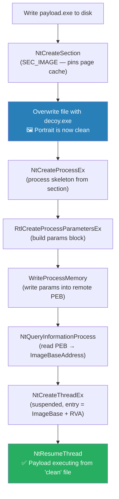

# Dorian

> Windows x64 — works on Windows 10 and Windows 11

A proof-of-concept for **Process Herpaderping** — a technique where a PE executes from a file that, on disk, contains something completely different. Like Dorian Gray: the portrait stays clean while the reality is something else.

Third in a series:
- [PeekABoo](https://github.com/SamiAdamMoughli/PeekABoo) — Process Ghosting (file marked for deletion)
- [Schrodinger](https://github.com/SamiAdamMoughli/Schrodinger) — Process Doppelgänging (NTFS transaction, never committed)
- **Dorian** — Process Herpaderping (file overwritten after section creation)

For research and authorized testing only. Don't use this against systems you don't own.

---

## How it works

`NtCreateSection` with `SEC_IMAGE` maps a PE into a section object and pins a reference to the file's page cache at that moment. If you then overwrite the file on disk, the section still maps the original content — the kernel doesn't re-read the file.

The trick:

1. Write the real PE payload to a file on disk
2. Call `NtCreateSection` with `SEC_IMAGE` — section now maps the original PE
3. Overwrite the file with decoy content (e.g. a copy of `calc.exe`)
4. The file on disk looks innocent — AV scanning it sees the decoy
5. Call `NtCreateProcessEx` with the section — process runs the original PE
6. Write process parameters, create a suspended thread, resume



---

## vs the rest of the series

| | PeekABoo (Ghosting) | Schrodinger (Doppelgänging) | Dorian (Herpaderping) |
| --- | --- | --- | --- |
| File on disk | Deleted | Never exists | Exists, contains decoy |
| Windows 10 | Works | ≤ 1709 only | Works |
| Windows 11 | Patched | Patched | **Works** |
| Technique | Deletion-pending section | TxF rollback | Post-write overwrite |
| File visible to AV | No (deleted) | No (never committed) | Yes — but looks innocent |

---

## Detection

- **NtCreateSection then WriteFile to same handle** — writing to a file after creating a `SEC_IMAGE` section from it is the definitive signature. No legitimate software does this.
- **File hash mismatch** — a running process whose mapped image doesn't match the file on disk. Memory forensics tools (Volatility, PE-sieve) catch this trivially.
- **NtCreateProcessEx called directly** — same heuristic as the rest of the series.
- **PE-sieve / hollows-hunter** — these tools specifically scan for `SEC_IMAGE` mappings that don't match their backing file. Dorian is a primary target.
- **PsSetCreateProcessNotifyRoutineEx** — a kernel driver can hash the backing file at process creation time and compare against a known-good list. If the file is `calc.exe` but the mapped PE is something else, flag it.

---

## Building

### CMake

```bat
cmake -B build -A x64
cmake --build build --config Release
```

Output: `build\Release\Dorian.exe`

### Visual Studio

1. New empty C++ project, platform x64, configuration Release
2. Add `src\` as source files, `include\dorian\` as additional include directory
3. Character set: Unicode
4. Link against `ntdll.lib`
5. Build

---

## Usage

```bat
Dorian.exe <payload.exe> <decoy.exe> [host_path]
```

- `payload.exe` — the PE you want to execute
- `decoy.exe` — what ends up on disk (AV sees this)
- `host_path` — where the file is staged (default: `C:\Windows\Temp\dorian.exe`)

Quick test on Windows 11:

```bat
copy C:\Windows\System32\calc.exe decoy.exe
copy C:\Windows\System32\mspaint.exe payload.exe
Dorian.exe payload.exe decoy.exe
```

Paint launches. On disk, `C:\Windows\Temp\dorian.exe` contains `calc.exe`.
# Dorian
# Dorian
# Dorian
